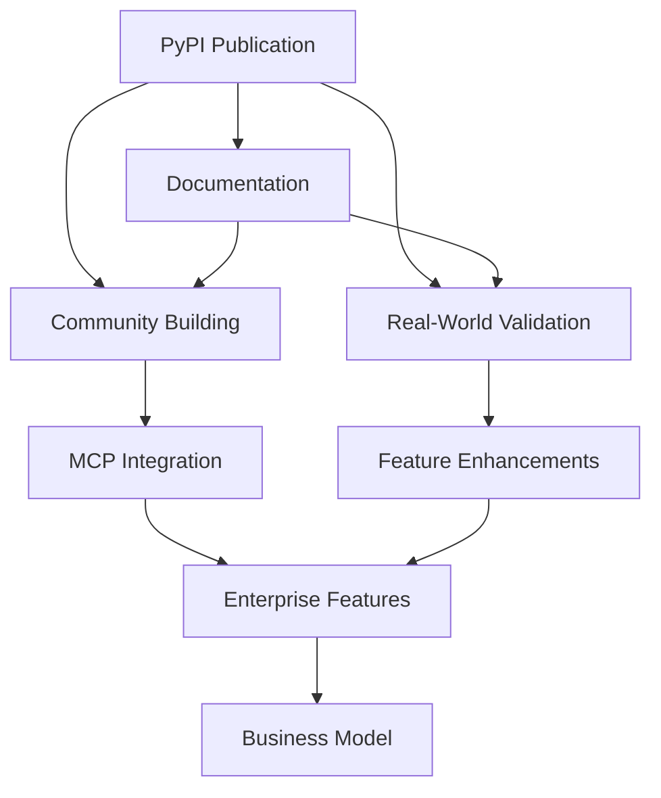

# AI Codebase Hygiene Toolkit - Next Steps

**Project Status**: Production-ready v2.0.0 with complete AI-focused transformation
**Date**: 2025-01-19
**Current Achievement**: Fully functional AI development hygiene toolkit with 0 unused imports and comprehensive agent architecture

## 🚀 Immediate Priorities (Next 1-2 weeks)

### 1. 📦 PyPI Publication & Distribution
- [ ] Package and publish to PyPI as `ai-codebase-hygiene-toolkit`
- [ ] Update GitHub repository description and topics for AI focus
- [ ] Create proper release with v2.0.0 tag and release notes
- [ ] Set up automated CI/CD for future releases
- [ ] Verify installation works across platforms

### 2. 📚 Documentation & Examples
- [ ] Create comprehensive getting started guide for AI developers
- [ ] Build example workflows for different AI development scenarios:
  - Claude Code development session
  - Cursor IDE integration
  - GitHub Copilot workflow
  - Multi-developer AI team coordination
- [ ] Record demo videos showing toolkit in action
- [ ] Write migration guide from v1.x dependency tools to AI-focused v2.0

### 3. 🎯 Real-World Validation
- [ ] Use toolkit extensively on NPCGPT project to validate all features
- [ ] Collect quantitative metrics on effectiveness:
  - Pattern consistency improvements over time
  - Context optimization results
  - Architecture drift prevention success
- [ ] Document real success stories and case studies
- [ ] Refine algorithms based on actual AI development pain points

## 🌟 Short-term Growth (Next month)

### 4. 🤖 Model Context Protocol (MCP) Integration
**High Value Opportunity**: First MCP server for AI development hygiene
- [ ] Build MCP server that exposes toolkit functionality
- [ ] Enable real-time AI assistant integration during development
- [ ] Create proactive suggestions within Claude Code, Cursor, etc.
- [ ] Position as pioneering tool in AI-native development

### 5. 🌍 Community Building & Marketing
- [ ] Share on AI development communities:
  - Reddit: r/programming, r/MachineLearning, r/ChatGPT
  - Discord: Claude community, Cursor community
  - Twitter: AI development hashtags
- [ ] Write blog posts about AI development hygiene challenges
- [ ] Submit to newsletters, podcasts, and dev tool roundups
- [ ] Engage with Claude Code, Cursor, and GitHub Copilot communities
- [ ] Create compelling social media content showing before/after

### 6. 🔧 Feature Enhancements Based on Usage
- [ ] Add more sophisticated pattern detection algorithms
- [ ] Implement team collaboration features for AI development
- [ ] Create IDE plugins/extensions for popular editors
- [ ] Add support for more programming languages beyond Python
- [ ] Enhance context window optimization with smarter splitting suggestions

## 🏢 Medium-term Vision (Next 3 months)

### 7. Enterprise & Team Features
- [ ] Team dashboards for AI development patterns across developers
- [ ] Integration with popular development tools (Jira, Slack, GitHub)
- [ ] Enterprise reporting and compliance features
- [ ] White-label solutions for development teams
- [ ] Multi-project dependency tracking and coordination

### 8. 🧠 AI-Native Advanced Features
- [ ] Machine learning models trained on code pattern recognition
- [ ] Predictive analysis for architecture drift risks
- [ ] Automated refactoring suggestions based on AI development patterns
- [ ] Integration with emerging AI coding assistants
- [ ] Advanced session analytics with AI insights

### 9. 💼 Business Model Development
- [ ] Freemium model design (basic tools free, advanced features paid)
- [ ] Enterprise licensing for teams and organizations
- [ ] Consulting services for AI development transformation
- [ ] Training and certification programs
- [ ] Partnership opportunities with AI tool vendors

## 🎯 Success Metrics to Track

### Technical Metrics
- **Adoption Rate**: PyPI downloads and GitHub stars
- **Usage Patterns**: Which tools are used most frequently
- **Problem Resolution**: Reduction in context window violations, pattern inconsistencies
- **Performance**: Analysis speed and accuracy improvements

### Community Metrics
- **Community Growth**: GitHub contributors, Discord/forum engagement
- **Content Reach**: Blog post views, social media engagement
- **Developer Feedback**: Issue reports, feature requests, testimonials
- **Integration Success**: MCP usage, IDE plugin adoption

### Business Metrics
- **Market Penetration**: Enterprise inquiries and partnerships
- **Revenue Potential**: Premium feature interest, consulting requests
- **Competitive Position**: Comparison with other AI development tools
- **Brand Recognition**: Mentions in AI development discussions

## 🔥 High-Impact Quick Wins

### Week 1 Priorities
1. **PyPI Publication** - Get the toolkit easily installable
2. **GitHub Repository Polish** - Update description, add badges, clean README
3. **Basic Examples** - Create 3-4 compelling usage examples
4. **Social Media Launch** - Initial announcement posts

### Week 2 Priorities
1. **Documentation Website** - Proper documentation site with examples
2. **Demo Video** - 5-minute screencast showing toolkit value
3. **Community Outreach** - Post in relevant communities
4. **Real Usage** - Use extensively on NPCGPT for validation

## 💡 Unique Value Proposition

**"The first tool specifically designed for the AI development era"**

### Target Audience
- Developers using Claude Code, Cursor, GitHub Copilot
- Teams doing AI-assisted development
- Projects struggling with AI-generated code consistency
- Organizations managing AI development hygiene

### Competitive Advantages
- **AI-Native**: Built specifically for AI development challenges
- **Proactive**: Prevents problems before they become technical debt
- **Practical**: Provides actionable suggestions for immediate improvement
- **Comprehensive**: Covers all aspects of AI development hygiene
- **First-Mover**: Pioneering the AI development tooling space

## 🗺️ Roadmap Dependencies

## 📞 Next Session Action Items

**Recommended Starting Point**: PyPI publication and GitHub repository polish
**Immediate Value**: Get toolkit into hands of developers who need it
**Strategic Focus**: Position as the pioneering tool for AI development hygiene

---

**The AI Codebase Hygiene Toolkit is ready to transform how developers work with AI coding assistants. The next phase is about scaling impact and building community around this unique solution.**