# 🗺️ Dependency Toolkit

[](https://opensource.org/licenses/MIT)
[](https://www.python.org/downloads/)
[](https://github.com/scs03004/dependency-toolkit/issues)
[](https://github.com/scs03004/dependency-toolkit)

A **production-ready** suite of tools for managing, visualizing, and validating project dependencies across any codebase. Built for developers who need **enterprise-grade dependency management** without the complexity.

## ✨ **Recent Major Updates**

🌐 **Web-Native Mermaid Visualization** - Replaced heavy Graphviz with lightweight, GitHub-ready Mermaid graphs
🔒 **Security Hardened** - Fixed XSS vulnerabilities, hardcoded secrets, and dependency security issues  
🎨 **Code Quality** - Full Black formatting compliance and comprehensive security scanning
⚡ **Simplified CI** - Reliable, fast workflows that actually add value (no more complex matrix failures)
📱 **Mobile-Responsive** - Dependency graphs work perfectly on phones, tablets, and desktops

## 🎯 **Overview**

The Dependency Toolkit provides **six powerful tools** for comprehensive dependency management:

1. **🌐 Web-Native Mermaid Visualization** - GitHub-ready dependency graphs with zero system dependencies
2. **🔒 Pre-commit Dependency Validation** - Git hooks preventing broken dependencies
3. **🚀 CI/CD Integration Tools** - Automated workflows for GitHub Actions & GitLab CI
4. **📊 Real-time Monitoring Dashboard** - Live dependency health monitoring with web interface
5. **🧠 Smart Code Analysis Tools** - Unused import detection and technical debt scoring
6. **📚 Documentation Automation** - Auto-generated dependency maps and architecture docs

## 🚀 **Quick Start**

### Installation
```bash
# Install directly from GitHub
pip install git+https://github.com/scs03004/dependency-toolkit.git

# Or clone and install locally
git clone https://github.com/scs03004/dependency-toolkit.git
cd dependency-toolkit
pip install -e .
```

### Basic Usage
```bash
# Generate modern web-native dependency graph (default)
dependency-visualizer /path/to/project

# Generate Mermaid syntax for GitHub README
dependency-visualizer /path/to/project --format syntax

# Set up pre-commit validation
dependency-validator --install /path/to/project

# Analyze code quality and unused imports
dependency-analyzer /path/to/project --all

# Generate documentation
dependency-docs /path/to/project --output docs/

# Start real-time monitoring dashboard
dependency-monitor --start /path/to/project --server
```

## 📊 **Example Output**

### Real Project Analysis (NPCGPT)
```
✅ NPCGPT Dependency Analysis Results:
📁 Total Python files analyzed: 43
🔗 Total import relationships: 62
📦 External dependencies: 55
⚠️  Circular dependencies: 0
🔴 High-risk files: 12

📊 Project Metrics:
  • Total Files: 43
  • Total Imports: 63
  • External Dependencies: 55
  • High Risk Files: 12
  • Circular Dependencies: 0
  • Total Lines Of Code: 13,667

✅ No circular dependencies detected!

🔴 High-Risk Files (require careful change management):
  • config.py (138 LOC, 7 dependents)
  • main.py (152 LOC, 3 dependents)
  • api\routes.py (1489 LOC, 1 dependents)
  • models\database.py (37 LOC, 11 dependents)
  • llm\personality_engine.py (487 LOC, 5 dependents)
```

### Code Quality Analysis
```
Import Analysis: Found 37 unused imports out of 157 total

Technical Debt Analysis: Analyzed 7 files
High Priority Technical Debt:
  • tools\code_analyzer.py - Debt Score: 121.1 (3-5 days effort)
  • tools\doc_generator.py - Debt Score: 82.3 (3-5 days effort)
  • Large file size, High cyclomatic complexity detected

Architecture Analysis: Found 4 violations
  • Single responsibility violations
  • Interface segregation issues

Summary: Found 47 total issues requiring attention
```

### Web-Native Mermaid Graph
The toolkit now generates modern, web-native dependency graphs that render perfectly in GitHub:

```mermaid
graph TD
    setup["setup"]
    tools_dependency_visualizer["dependency_visualizer"]
    tools_code_analyzer["code_analyzer"]
    tools_doc_generator["doc_generator"]
    tools_monitoring_dashboard["monitoring_dashboard"]
    tools_pre_commit_validator["pre_commit_validator"]
    tools_ci_cd_integrator["ci_cd_integrator"]

    %% Risk-based styling
    classDef high fill:#ff6b6b,stroke:#d63031,stroke-width:3px,color:#fff
    classDef medium fill:#ffd93d,stroke:#f39c12,stroke-width:2px,color:#2d3436
    classDef low fill:#6bcf7f,stroke:#00b894,stroke-width:1px,color:#2d3436

    class setup low
    class tools_dependency_visualizer medium
    class tools_code_analyzer medium
    class tools_doc_generator high
    class tools_monitoring_dashboard medium
    class tools_pre_commit_validator medium
    class tools_ci_cd_integrator medium
```



### Alternative Command Usage
```bash
# Generate GitHub-ready Mermaid syntax
dependency-visualizer /path/to/project --format syntax

# Generate interactive HTML dashboard (default)
dependency-visualizer /path/to/project --format mermaid
```

## 🛠️ **Tools**

### 1. Dependency Graph Visualizer
- **🌐 Web-native Mermaid graphs** - No installation dependencies, GitHub-ready
- **📱 Mobile-responsive design** - Works perfectly on all devices
- **🎨 Risk-based color coding** - Instant visual risk assessment
- **⚡ Zero-dependency visualization** - Pure web technologies
- **📋 Multiple formats**: Mermaid HTML, raw syntax (.mmd), text trees
- **🔗 GitHub integration** - Renders natively in README files

### 2. Pre-commit Validator
- **Import validation** - Check for broken imports before commit
- **Dependency impact analysis** - Warn about high-risk changes
- **Auto-test triggering** - Run tests based on changed dependencies
- **Documentation sync** - Ensure docs match code structure

### 3. CI/CD Integration
- **GitHub Actions workflows** for automated dependency checking
- **Dependency change notifications** in pull requests
- **Risk-based testing** - Different test suites based on impact
- **Deployment safety checks** before production

### 4. Real-time Monitoring
- **Live dependency dashboard** showing system health
- **Performance impact tracking** of dependency changes
- **Usage analytics** for dependency optimization
- **Automated alerts** for circular dependencies

### 5. Smart Code Analysis
- **Unused import detection** and cleanup suggestions
- **Coupling analysis** for refactoring opportunities
- **Architecture violation detection** against established patterns
- **Technical debt scoring** based on dependency complexity

### 6. Documentation Automation
- **Auto-generated dependency maps** from code analysis
- **Living architecture diagrams** that update with changes
- **Impact analysis reports** for stakeholders
- **Dependency changelogs** showing evolution over time

## 📁 **Project Structure**

```
dependency-toolkit/
├── tools/                          # Core dependency management tools
│   ├── dependency_visualizer.py    # Graph generation and visualization
│   ├── pre_commit_validator.py     # Git hook validation
│   ├── ci_cd_integrator.py         # CI/CD pipeline tools
│   ├── monitoring_dashboard.py     # Real-time monitoring
│   ├── code_analyzer.py            # Smart analysis tools
│   └── doc_generator.py            # Documentation automation
├── templates/                      # Reusable templates
│   ├── DEPENDENCY_MAP_TEMPLATE.md  # Standard dependency map format
│   ├── CHANGE_IMPACT_CHECKLIST.md  # Change management checklist
│   └── dependency_report.html      # HTML report template
├── .github/workflows/              # CI/CD workflows
│   ├── dependency_check.yml        # Automated dependency validation
│   └── documentation_update.yml    # Auto-update documentation
├── tests/                          # Comprehensive test suite
├── examples/                       # Example usage and integrations
├── docs/                          # Detailed documentation
└── config/                        # Configuration files
```

## 🎯 **Use Cases**

### For Individual Developers
- **Understand codebase structure** before making changes
- **Avoid breaking dependencies** with pre-commit validation
- **Track technical debt** and refactoring opportunities

### For Teams
- **Coordinate changes** across complex codebases
- **Standardize dependency management** across projects
- **Reduce integration issues** with automated validation

### For DevOps
- **Automate dependency checking** in CI/CD pipelines
- **Monitor system health** in real-time
- **Generate compliance reports** for stakeholders

## 📚 **Documentation**

- **[Getting Started Guide](docs/getting-started.md)** - Installation and basic usage
- **[Tool Reference](docs/tool-reference.md)** - Detailed documentation for each tool
- **[Integration Guide](docs/integration.md)** - CI/CD and workflow integration
- **[API Reference](docs/api-reference.md)** - Programmatic usage
- **[Best Practices](docs/best-practices.md)** - Recommended workflows

## 🤝 **Contributing**

We welcome contributions! Please see [CONTRIBUTING.md](CONTRIBUTING.md) for guidelines.

## 📄 **License**

MIT License - see [LICENSE](LICENSE) for details.

## 🌟 **Features**

- ✅ **Web-Native Visualization** - Mermaid graphs work everywhere, no dependencies
- ✅ **GitHub Ready** - Native rendering in README files and documentation
- ✅ **Security Hardened** - XSS protection, secure secret handling, vulnerability scanning
- ✅ **CI/CD Friendly** - Simple, reliable workflows that actually work
- ✅ **Cross-Platform** - Windows, macOS, Linux support
- ✅ **Mobile Responsive** - Perfect visualization on any device
- ✅ **Zero Installation** - Web-based graphs work immediately
- ✅ **Code Quality** - Black formatting, Bandit security scanning, comprehensive testing
- ✅ **Open Source** - Free to use and modify

## 🚀 **What's New in v1.1.0**

### Major Improvements
- **🌐 Mermaid Visualization**: Zero-dependency, GitHub-native graphs
- **🔒 Security Hardening**: Fixed XSS vulnerabilities and hardcoded secrets
- **⚡ Simplified CI**: Reliable workflows that don't break every commit
- **📱 Mobile-First**: Responsive design that works on all devices
- **🎨 Code Quality**: Full Black formatting and security scanning

### Breaking Changes
- Replaced Plotly with Mermaid as default visualization (use `--format html` for legacy Plotly)
- Simplified GitHub Actions workflows (complex matrix testing disabled)

### Migration Guide
- **Old**: `dependency-visualizer project --format html` (Plotly)
- **New**: `dependency-visualizer project` (Mermaid HTML dashboard)
- **GitHub**: `dependency-visualizer project --format syntax` (raw .mmd for README)

---

**Built with ❤️ for better dependency management**