# 🤖 AI Codebase Hygiene Toolkit

[](https://opensource.org/licenses/MIT)
[](https://www.python.org/downloads/)
[](https://github.com/scs03004/deepflow/issues)
[](https://github.com/scs03004/deepflow)

**Keep AI-assisted codebases clean, consistent, and maintainable**

Stop AI development from turning your codebase into a mess. Specialized tools for developers using Claude Code, Cursor, GitHub Copilot, and other AI coding assistants.

## 🚨 **The Problem: AI Makes Code Fast, But Messy Fast**

- ❌ **Pattern Inconsistency**: AI generates different patterns for similar problems across sessions
- ❌ **Architecture Drift**: Small AI changes gradually violate intended architecture  
- ❌ **Context Explosion**: Files grow too large for AI context windows
- ❌ **Session Fragmentation**: Code gets modified without continuity between AI sessions
- ❌ **Technical Debt Accumulation**: Rapid AI prototyping creates cleanup debt

## ✅ **The Solution: Continuous AI-Aware Code Hygiene**

🤖 **AI Session Tracking** - Monitor changes across AI development sessions with continuity analysis
🎯 **Pattern Consistency** - Detect and fix inconsistent code patterns generated by AI tools
🏗️ **Architecture Guardrails** - Prevent gradual architectural violations before they become problems
📏 **Context Management** - Keep files and modules optimized for AI context windows
📊 **AI Quality Metrics** - Specialized metrics for AI-generated vs human-written code quality

## 🛠️ **AI-Aware Tools**

The AI Codebase Hygiene Toolkit provides **specialized tools** for AI-assisted development:

1. **🤖 AI Session Tracker** - Track and analyze changes across AI development sessions
2. **🎯 Pattern Consistency Analyzer** - Detect inconsistent code patterns generated by AI tools
3. **🏗️ Architecture Guardian** - Prevent gradual architectural drift during AI development
4. **📏 Context Window Optimizer** - Keep files optimized for AI context windows
5. **🌐 AI-Aware Dependency Visualization** - Mermaid graphs with AI development insights
6. **📊 AI Code Quality Metrics** - Specialized analysis for AI-generated code patterns

## 🚀 **Quick Start**

### Installation
```bash
# Install directly from GitHub
pip install git+https://github.com/scs03004/deepflow.git

# Or clone and install locally
git clone https://github.com/scs03004/deepflow.git
cd deepflow
pip install -e .
```

### Basic Usage
```bash
# Track AI development session
ai-session-tracker start "feature-implementation"

# Analyze codebase with AI-awareness
deepflow-visualizer /path/to/project --ai-awareness

# Check pattern consistency across AI sessions
code-analyzer /path/to/project --ai-metrics --pattern-consistency

# Optimize for AI context windows
context-optimizer /path/to/project --target-tokens 8000

# Monitor architecture drift during AI development
architecture-guardian /path/to/project --enforce-patterns

# End AI session with impact summary
ai-session-tracker end --generate-report
```

## 📊 **Example Output**

### AI Session Analysis (Real Project)
```
🤖 AI Session Impact Report - "user-auth-implementation"
📅 Session Duration: 2.5 hours (3 Claude Code interactions)
📁 Files Modified: 8 files across 3 modules

🎯 Pattern Consistency Analysis:
✅ Authentication patterns: 95% consistent
⚠️  Error handling patterns: 67% consistent (3 different styles detected)
❌ Logging patterns: 45% consistent (needs standardization)

📏 Context Window Health:
✅ 6 files remain AI-context friendly (<2000 tokens)
⚠️  2 files approaching context limits (>3000 tokens)
  • controllers/auth_controller.py (3,847 tokens)
  • models/user_model.py (3,234 tokens)

🏗️ Architecture Drift Detection:
✅ No layer violations detected
⚠️  1 potential coupling issue:
  • auth_service.py directly importing from presentation layer

💡 AI Development Recommendations:
  1. Standardize error handling patterns across auth module
  2. Consider splitting user_model.py for better AI context
  3. Review auth_service coupling before next session
```

### AI Code Quality Analysis
```
🤖 AI-Generated Code Analysis: 73% of recent changes are AI-assisted

📊 Pattern Consistency Score: 78/100
  • Function naming: 95% consistent
  • Error handling: 62% consistent (needs attention)
  • Import organization: 89% consistent

📏 Context Window Optimization:
  • 12 files are AI-context friendly (<2K tokens)
  • 3 files approaching limits (2K-4K tokens)
  • 1 file requires splitting (>4K tokens)

🏗️ AI Architecture Impact:
  • Session fragmentation risk: Medium
  • Pattern drift detected in authentication module
  • 2 layer violations introduced during AI sessions

💡 Cleanup Recommendations:
  1. Standardize error handling patterns (15 min effort)
  2. Split large user.py file for better AI context (30 min)
  3. Consolidate authentication patterns (45 min)
```

### Web-Native Mermaid Graph
The toolkit now generates modern, web-native dependency graphs that render perfectly in GitHub:

```mermaid
graph TD
    setup["setup"]
    tools_dependency_visualizer["dependency_visualizer"]
    tools_code_analyzer["code_analyzer"]
    tools_doc_generator["doc_generator"]
    tools_monitoring_dashboard["monitoring_dashboard"]
    tools_pre_commit_validator["pre_commit_validator"]
    tools_ci_cd_integrator["ci_cd_integrator"]

    %% Risk-based styling
    classDef high fill:#ff6b6b,stroke:#d63031,stroke-width:3px,color:#fff
    classDef medium fill:#ffd93d,stroke:#f39c12,stroke-width:2px,color:#2d3436
    classDef low fill:#6bcf7f,stroke:#00b894,stroke-width:1px,color:#2d3436

    class setup low
    class tools_dependency_visualizer medium
    class tools_code_analyzer medium
    class tools_doc_generator high
    class tools_monitoring_dashboard medium
    class tools_pre_commit_validator medium
    class tools_ci_cd_integrator medium
```



### Alternative Command Usage
```bash
# Generate GitHub-ready Mermaid syntax
deepflow-visualizer /path/to/project --format syntax

# Generate interactive HTML dashboard (default)
deepflow-visualizer /path/to/project --format mermaid
```

## 🛠️ **AI-Aware Tools**

### 1. AI Session Tracker (`ai-session-tracker`)
- **🤖 Session monitoring** - Track changes across AI development sessions
- **📊 Impact analysis** - Understand how AI sessions affect codebase quality
- **🔗 Continuity tracking** - Maintain context between AI interactions
- **📝 Session reports** - Generate summaries of AI development impact
- **⏱️ Time tracking** - Monitor AI development velocity and patterns

### 2. AI-Aware Dependency Visualizer (`deepflow-visualizer --ai-awareness`)
- **🌐 Context window heatmaps** - Visual indication of files approaching AI limits
- **🎯 Pattern consistency coloring** - Highlight inconsistent code patterns
- **📱 AI session timeline** - Show how dependencies evolved across sessions
- **🔍 Architecture drift detection** - Visual warnings for architectural violations
- **📋 AI-optimized outputs** - Multiple formats optimized for AI consumption

### 3. Pattern Consistency Analyzer (`code-analyzer --ai-metrics`)
- **🎯 Pattern drift detection** - Identify inconsistent code patterns from AI
- **📊 Consistency scoring** - Quantify pattern consistency across modules
- **🔍 Style violation tracking** - Monitor coding style inconsistencies
- **💡 Standardization suggestions** - Recommend pattern consolidation
- **📈 Trend analysis** - Track pattern consistency over time

### 4. Context Window Optimizer (`context-optimizer`)
- **📏 Token counting** - Analyze files for AI context window efficiency
- **✂️ Split suggestions** - Recommend module splitting for better AI comprehension
- **🔍 Complexity analysis** - Identify overly complex files that break AI flow
- **📊 Context health scoring** - Monitor AI-friendliness of codebase
- **💡 Refactoring recommendations** - Suggest optimizations for AI development

### 5. Architecture Guardian (`architecture-guardian`)
- **🏗️ Pattern enforcement** - Define and enforce architectural rules
- **🚨 Drift detection** - Identify gradual violations during AI sessions
- **📐 Layer validation** - Ensure proper separation of concerns
- **🔄 Dependency direction** - Monitor for architectural anti-patterns
- **📋 Compliance reporting** - Generate architecture health reports

### 6. AI Development Documentation
- **📝 Session logs** - Auto-document AI development sessions
- **🌐 Living architecture** - Keep architecture docs synced with AI changes
- **📊 Pattern evolution** - Track how code patterns change over time
- **🔍 Impact reports** - Document AI session impacts for review

## 📁 **Project Structure**

```
deepflow/
├── tools/                          # Core dependency management tools
│   ├── dependency_visualizer.py    # Graph generation and visualization
│   ├── pre_commit_validator.py     # Git hook validation
│   ├── ci_cd_integrator.py         # CI/CD pipeline tools
│   ├── monitoring_dashboard.py     # Real-time monitoring
│   ├── code_analyzer.py            # Smart analysis tools
│   └── doc_generator.py            # Documentation automation
├── templates/                      # Reusable templates
│   ├── DEPENDENCY_MAP_TEMPLATE.md  # Standard dependency map format
│   ├── CHANGE_IMPACT_CHECKLIST.md  # Change management checklist
│   └── dependency_report.html      # HTML report template
├── .github/workflows/              # CI/CD workflows
│   ├── dependency_check.yml        # Automated dependency validation
│   └── documentation_update.yml    # Auto-update documentation
├── tests/                          # Comprehensive test suite
├── examples/                       # Example usage and integrations
├── docs/                          # Detailed documentation
└── config/                        # Configuration files
```

## 🎯 **Use Cases**

### For AI-Assisted Developers
- **Maintain code quality** during rapid AI development sessions
- **Prevent pattern inconsistencies** across AI-generated code
- **Optimize files** for better AI context window utilization
- **Track architectural drift** introduced by AI modifications

### For Development Teams Using AI
- **Standardize AI development practices** across team members
- **Coordinate AI sessions** without breaking existing patterns
- **Review AI-generated code** for consistency and quality
- **Maintain codebase hygiene** during fast AI prototyping

### For Project Leads & Architects
- **Monitor AI development impact** on codebase architecture
- **Enforce coding standards** during AI-assisted development
- **Generate reports** on AI development session outcomes
- **Plan refactoring** based on AI-introduced technical debt

## 📚 **Documentation**

- **[Getting Started Guide](docs/getting-started.md)** - Installation and basic usage
- **[Tool Reference](docs/tool-reference.md)** - Detailed documentation for each tool
- **[Integration Guide](docs/integration.md)** - CI/CD and workflow integration
- **[API Reference](docs/api-reference.md)** - Programmatic usage
- **[Best Practices](docs/best-practices.md)** - Recommended workflows

## 🤝 **Contributing**

We welcome contributions! Please see [CONTRIBUTING.md](CONTRIBUTING.md) for guidelines.

## 📄 **License**

MIT License - see [LICENSE](LICENSE) for details.

## 🌟 **AI-Focused Features**

- ✅ **AI Session Tracking** - Monitor and analyze AI development sessions
- ✅ **Pattern Consistency** - Detect and fix inconsistent AI-generated patterns
- ✅ **Context Window Optimization** - Keep files AI-context friendly
- ✅ **Architecture Drift Prevention** - Guard against gradual AI-introduced violations
- ✅ **AI-Aware Visualization** - Mermaid graphs with AI development insights
- ✅ **Cross-Platform** - Works with Claude Code, Cursor, GitHub Copilot
- ✅ **Real-time Monitoring** - Live feedback during AI development
- ✅ **Session Continuity** - Maintain context across AI interactions
- ✅ **Open Source** - Free to use and extend for your AI workflow

## 🚀 **What's New in v2.0.0 - AI Codebase Hygiene Edition**

### 🤖 AI-Focused Transformation
- **AI Session Tracking**: Complete rewrite as an AI development companion
- **Pattern Consistency Engine**: New algorithms for detecting AI-generated inconsistencies
- **Context Window Intelligence**: Smart analysis for AI-friendly code organization
- **Architecture Drift Prevention**: Real-time monitoring of AI-introduced violations

### 🛠️ New AI-Aware Tools
- **ai-session-tracker**: Track and analyze AI development sessions
- **context-optimizer**: Optimize files for AI context windows
- **architecture-guardian**: Prevent gradual architectural violations

### 🔄 Enhanced Existing Tools
- **deepflow-visualizer --ai-awareness**: AI development timeline visualization
- **code-analyzer --ai-metrics**: Pattern consistency and AI code quality analysis

### Migration from v1.x
- **Old Focus**: General dependency management
- **New Focus**: AI-assisted development hygiene
- **Compatibility**: All existing commands work with new `--ai-awareness` flags

---

**Built with ❤️ for clean AI-assisted development**
